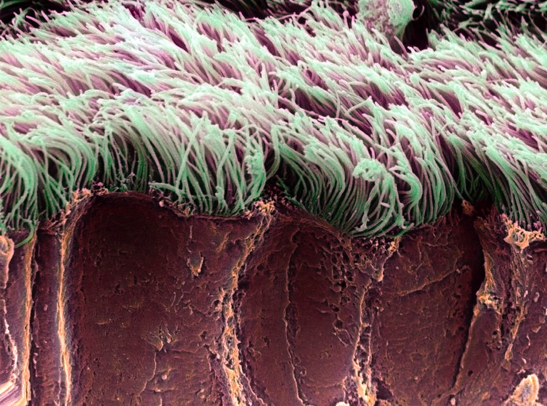

+++
title = "Coarse grained fiber beds"
date = 2019-01-01
draft = false

authors = []

# Tags: can be used for filtering projects.
# Example: `tags = ["machine-learning", "deep-learning"]`
tags = []

# Project summary to display on homepage.
summary = ""

# Slides (optional).
#   Associate this page with Markdown slides.
#   Simply enter your slide deck's filename without extension.
#   E.g. `slides = "example-slides"` references 
#   `content/slides/example-slides.md`.
#   Otherwise, set `slides = ""`.
slides = ""

# Optional external URL for project (replaces project detail page).
external_link = ""

# Links (optional).
url_pdf = ""
url_code = ""
url_dataset = ""
url_slides = ""
url_video = ""
url_poster = ""

# Custom links (optional).
#   Uncomment line below to enable. For multiple links, use the form `[{...}, {...}, {...}]`.
# links = [{icon_pack = "fab", icon="twitter", name="Follow", url = "https://twitter.com"}]

# Featured image
# To use, add an image named `featured.jpg/png` to your page's folder. 
[image]
  preview_only = true
  caption = ""

  # Caption (optional)

  # Focal point (optional)
  # Options: Smart, Center, TopLeft, Top, TopRight, Left, Right, BottomLeft, Bottom, BottomRight
  focal_point = ""
+++

Systems of dense fibers play a pivotal role in a wide range of biological phenomenon, from mucosal clearance by ciliary pumping to the centering of the mitotic spinidle. In this project, we construct a Brinkman-like coarse grained model for beds of cilia based on local slender body theory. The model permits analytic

